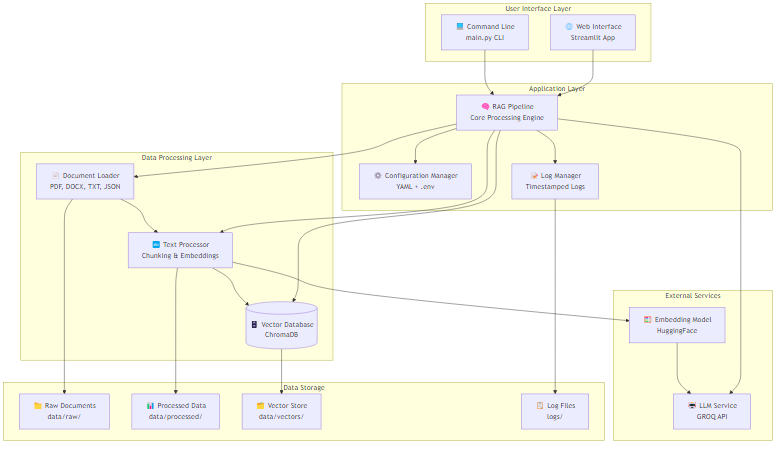

# Technical and Design Document: RAG Pipeline Retrieval-Augmented Generation System

## Abstract

RAG Pipeline is a modular, production-ready Retrieval-Augmented Generation (RAG) system for document-based question answering. It integrates ChromaDB for vector search, LangChain for orchestration, and GROQ for large language model (LLM) inference. The system supports both a modern Streamlit web interface and a comprehensive command-line interface (CLI), enabling flexible, scalable, and secure document ingestion, retrieval, and conversational AI workflows.

## 1. Introduction and Motivation

The exponential growth of unstructured data has created a need for systems that can efficiently retrieve and synthesize information from large document collections. RAG Pipeline addresses this by combining state-of-the-art vector search with LLMs, providing both technical and non-technical users with powerful tools for document-based Q&A, analytics, and knowledge management.

## 2. System Architecture

### 2.1 High-Level Overview

*Figure 1: High-level system architecture showing all major components and their relationships*

The RAG Pipeline system is organized into five main layers:

- **User Interface Layer**: Dual interface—Streamlit web UI and CLI—for all operations.
- **Application Layer**: Core processing engine with configuration and logging management.
- **Data Processing Layer**: Document loading, text processing, and vector database operations.
- **External Services**: LLM and embedding model integrations.
- **Data Storage**: File system organization for raw documents, processed data, vectors, and logs.

### 2.2 Component Diagram

*Figure 2: System Architecture showing the main components and their interactions*

## 3. Key Modules and Their Roles

- **main.py**: CLI entry point; orchestrates all backend operations.
- **app.py**: Streamlit web interface; mirrors CLI functionality with a modern UI.
- **src/rag_pipeline.py**: Core pipeline; manages ingestion, retrieval, and LLM calls.
- **src/ingestion/document_loader.py**: Loads and parses PDF, DOCX, TXT, and JSON files.
- **src/utils/config_loader.py**: Loads YAML config with dot-notation access.
- **src/utils/init_manager.py**: Initializes logging, loads .env, and sets up environment.
- **src/utils/log_manager.py**: Handles timestamped log file creation and management.

## 4. Data Flow and Processing Pipeline

*Figure 3: Data flow sequence showing the end-to-end process from document ingestion to query response*

## 5. Security and Configuration

- **Secrets Management**: All API keys (e.g., GROQ_API_KEY) are loaded from a `.env` file (see `.env.example`).
- **Configuration**: System behavior is controlled via `config/config.yaml` (logging, LLM, vector DB, etc.).
- **Best Practices**: `.env` is git-ignored; `.env.example` is provided for onboarding.

## 6. Extensibility and Customization

*Figure 4: Extensibility diagram showing pluggable components and configuration-driven architecture*

- **Pluggable Embeddings**: Swap HuggingFace models via config.
- **LLM Agnostic**: Easily switch LLM providers by updating config and .env.
- **Custom Ingestion**: Extend `document_loader.py` for new file types.
- **UI/UX**: Add new Streamlit pages or CLI commands as needed.

## 7. CLI and Web UI Design

- **CLI**: Supports all operations (init, ingest, query, stats, clear, logs, etc.) with rich help and examples.
- **Web UI**: Streamlit app with dashboard, chat, ingestion, stats, and log management.
- **Interactive Mode**: CLI supports conversational Q&A with `/stats`, `/help`, `/quit` commands.

## 8. Logging, Monitoring, and Testing

- **Logging**: Timestamped log files per session; configurable via YAML.
- **Monitoring**: Real-time stats in both CLI and web UI.
- **Testing**: CLI commands for component and end-to-end tests; pytest integration.

## 9. Supported Formats and Deployment

- **Documents**: PDF, DOCX, TXT, JSON (extensible).
- **Deployment**: Cross-platform (Windows, Linux, Mac); web UI via Streamlit; CLI via Python.
- **Hosting**: See `docs/Streamlit_Hosting.md` for deployment options.

## 10. References and Future Work

- **References**:
  - ChromaDB: https://www.trychroma.com/
  - LangChain: https://www.langchain.com/
  - GROQ: https://groq.com/
  - Streamlit: https://streamlit.io/

- **Future Work**:
  - Add support for more LLM providers (OpenAI, Azure, etc.)
  - Advanced analytics and visualization modules
  - Distributed/clustered vector store support
  - Enhanced security and RBAC for multi-user deployments
  - Automated document ingestion pipelines

---

*For implementation details, see the codebase and README. For deployment, see the Streamlit hosting guide in `docs/`.* 